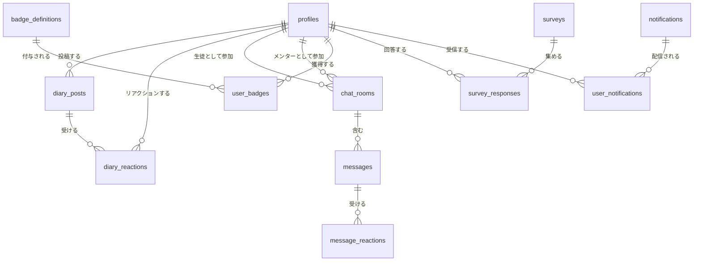

# ADR-005: バックエンド連携アーキテクチャ

> 決定日: 2025-12-11
> ステータス: **議論中（Draft）**
> 廃止対象: ADR-002（バックエンド非連携）

---

## 設計方針

**TypeScript統一**のモダンなフルスタック構成を採用。既存フロントエンド実装に引きずられず、ベストプラクティスに基づいて再構築する。

---

## 既存実装との不整合と設計判断

> [!IMPORTANT]
> 以下は既存フロントエンド型定義との突合せで発見した問題点と、それに対する**明示的な設計決定**である。

### 1. 型定義の分散

| 問題 | 現状 | 決定 |
|------|------|------|
| カレンダー型がローカル | `features/student/types/calendar.ts` に `ActivityDay`, `CalendarData` 等が定義 | **DBには保存しない**。`diary_posts.created_at` から動的に算出 |
| `shared/types/calendar.ts` 不在 | ローカル型のまま | フロントエンドは現状維持。バックエンドは投稿日からクエリで算出 |

**理由**: 活動記録を別テーブルで二重管理するより、日報投稿日から動的算出する方がデータ整合性が高い。

### 2. Notification型のフィールド名不一致

| フロントエンド型 | specs/features/notification.md | 決定 |
|-----------------|-------------------------------|------|
| `message: string` | `content: string` | **`content`に統一**（specsに合わせる） |
| `createdAt: string` | `timestamp: string` | **`created_at`に統一**（DB標準命名） |
| `read: boolean` | `isRead: boolean` | **`is_read`に統一**（DB標準命名） |

### 3. Badge型の曖昧なフィールド

| フロントエンド型 | 問題 | 決定 |
|-----------------|------|------|
| `condition?: string` | 任意になっている | **必須に変更**。バッジには必ず獲得条件がある |
| `progress?: number` | 任意 | DBでは**別テーブル `user_badge_progress`** で管理 |
| `status?: BadgeStatus` | 任意 | DBでは `user_badges` の存在有無とprogressから**動的算出** |

### 4. Survey型の`targetGroups`

| フロントエンド型 | 問題 | 決定 |
|-----------------|------|------|
| `targetGroups?: string[]` | 曖昧（グループの定義がない） | **Phase 1では未実装**。全ユーザー配信のみ |

### 5. チャットの「担当メンター」割り当て

| 問題 | 現状 | 決定 |
|------|------|------|
| 生徒とメンターの紐付け | 不明確 | **`chat_rooms`テーブルで管理**。1生徒1メンター固定（MVP） |
| メンター変更 | 未定義 | Phase 1では**変更不可**。管理者が直接DBで変更 |

---

## システム全体像

### CO+ Study とは

学習意欲のある小中学生を、高専生メンターが支援する学習記録・相談Webアプリ。

### ユーザーロール

| ロール | 対象 | 主な機能 | DB `role` 値 |
|--------|------|----------|-------------|
| 生徒 | 小中学生 | 日報作成、チャット相談、実績閲覧、アンケート回答 | `student` |
| メンター | 高専生 | 日報へのリアクション、チャット対応、お知らせ配信 | `mentor` |
| 管理者 | 運営者 | メンター管理、アンケート作成、システム設定 | `admin` |

### 機能一覧

| 機能 | 説明 | リアルタイム | DB依存テーブル |
|------|------|-------------|---------------|
| 学習日報 | SNS風タイムラインで学習記録 | - | `diary_posts`, `diary_reactions` |
| 相談チャット | メンターとの1対1チャット | ✓ | `chat_rooms`, `messages`, `message_reactions` |
| 実績 | カレンダー、バッジ、連続日数 | - | `badge_definitions`, `user_badges` |
| アンケート | 運営からの調査収集 | - | `surveys`, `survey_responses` |
| お知らせ | 運営からの通知配信 | ✓ | `notifications`, `user_notifications` |

---

## 技術スタック

### 全体構成

```
┌──────────────────────────────────────────────────────────────┐
│                    Frontend (React 18 + Vite)                 │
│                   @supabase/supabase-js v2                    │
│                   @tanstack/react-query v5                    │
└──────────────────────────────────────────────────────────────┘
                              │
                              ▼
┌──────────────────────────────────────────────────────────────┐
│                     Supabase Platform                         │
│  ┌──────────┐  ┌───────────┐  ┌──────────┐  ┌──────────┐    │
│  │   Auth   │  │ PostgreSQL│  │ Realtime │  │ Storage  │    │
│  │匿名/OAuth│  │   + RLS   │  │WebSocket │  │  画像    │    │
│  └──────────┘  └───────────┘  └──────────┘  └──────────┘    │
│  ┌──────────────────────────────────────────────────────┐   │
│  │           Edge Functions (Deno + TypeScript)          │   │
│  │  - バッジ判定（日報投稿トリガー）                      │   │
│  │  - 連続日数計算                                        │   │
│  │  - アンケートスケジュール（Cron）                      │   │
│  └──────────────────────────────────────────────────────┘   │
└──────────────────────────────────────────────────────────────┘
```

---

## 認証設計

### 段階的認証モデル

| Phase | 方式 | 実装 | リスク |
|-------|------|------|--------|
| 1 | 匿名認証 | `supabase.auth.signInAnonymously()` | 端末紛失＝アカウント喪失 |
| 2 | Google OAuth | `supabase.auth.linkIdentity({ provider: 'google' })` | - |
| 3 | Email/Password | `supabase.auth.updateUser({ email, password })` | メール確認OFF（小規模のため） |

---

## データベース設計（厳密版）

### 命名規則

| 規則 | 例 |
|------|-----|
| テーブル名 | `snake_case`、複数形（`diary_posts`） |
| カラム名 | `snake_case`（`created_at`） |
| 外部キー | `{参照先単数形}_id`（`user_id`, `post_id`） |
| タイムスタンプ | `timestamptz`（タイムゾーン付き） |
| UUID | `gen_random_uuid()` |

### ER図



---

### テーブル定義

#### 1. `profiles` （ユーザー拡張）

```sql
create table public.profiles (
  -- PK: Supabase Auth の user id を直接使用
  id uuid references auth.users on delete cascade primary key,
  
  -- ロール（厳密なenum）
  role text not null default 'student'
    check (role in ('student', 'mentor', 'admin')),
  
  -- 表示名（必須、空文字不可）
  display_name text not null check (char_length(display_name) >= 1),
  
  -- アバター画像URL（Supabase Storage）
  avatar_url text,
  
  -- 学年（生徒のみ、例: '小学3年', '中学2年'）
  -- メンター・管理者はnull
  grade text check (
    grade is null or 
    grade in ('小学1年','小学2年','小学3年','小学4年','小学5年','小学6年',
              '中学1年','中学2年','中学3年')
  ),
  
  -- 性別（メンター表示名決定用: おにいさん/おねえさん）
  gender text check (gender is null or gender in ('male', 'female')),
  
  -- 監査カラム
  created_at timestamptz not null default now(),
  updated_at timestamptz not null default now()
);

-- 更新日時自動更新トリガー
create or replace function update_updated_at()
returns trigger as $$
begin
  new.updated_at = now();
  return new;
end;
$$ language plpgsql;

create trigger profiles_updated_at
  before update on profiles
  for each row execute function update_updated_at();
```

#### 2. `diary_posts` （学習日報）

```sql
-- 教科のenum型（型安全）
create type subject_type as enum (
  '国語', '数学', '理科', '社会', '英語', 'その他'
);

create table public.diary_posts (
  id uuid primary key default gen_random_uuid(),
  
  -- 投稿者（profilesへのFK）
  user_id uuid not null references profiles on delete cascade,
  
  -- 教科（enum）
  subject subject_type not null,
  
  -- 学習時間（分単位、1分〜59999分 = 約999時間）
  duration_minutes int not null check (duration_minutes between 1 and 59999),
  
  -- 学習内容（1〜500文字）
  content text not null check (
    char_length(content) >= 1 and char_length(content) <= 500
  ),
  
  -- 投稿日時
  created_at timestamptz not null default now()
);

-- インデックス：ユーザー別の投稿取得高速化
create index idx_diary_posts_user_id on diary_posts(user_id);
create index idx_diary_posts_created_at on diary_posts(created_at desc);
```

#### 3. `diary_reactions` （日報リアクション）

```sql
-- リアクション絵文字（厳密なenum）
create type reaction_emoji as enum ('👍', '❤️', '🎉', '👏', '🔥');

create table public.diary_reactions (
  id uuid primary key default gen_random_uuid(),
  
  post_id uuid not null references diary_posts on delete cascade,
  
  -- リアクションした人（メンターのみ）
  user_id uuid not null references profiles on delete cascade,
  
  reaction_type reaction_emoji not null,
  
  created_at timestamptz not null default now(),
  
  -- 同一投稿に同じ絵文字は1人1回まで
  unique (post_id, user_id, reaction_type)
);
```

#### 4. `chat_rooms` （チャットルーム）

```sql
create table public.chat_rooms (
  id uuid primary key default gen_random_uuid(),
  
  -- 生徒（1ルームに1人）
  student_id uuid not null references profiles on delete cascade,
  
  -- メンター（1ルームに1人）
  mentor_id uuid not null references profiles on delete cascade,
  
  created_at timestamptz not null default now(),
  
  -- 1組の生徒-メンターペアにつき1ルームのみ
  unique (student_id, mentor_id)
);

-- 設計判断: 1生徒1メンター固定（MVP）
-- 将来的に複数メンター対応する場合は中間テーブルに変更
```

#### 5. `messages` （チャットメッセージ）

```sql
create type message_type as enum ('text', 'image');

create table public.messages (
  id uuid primary key default gen_random_uuid(),
  
  room_id uuid not null references chat_rooms on delete cascade,
  sender_id uuid not null references profiles on delete cascade,
  
  -- メッセージ種別
  message_type message_type not null default 'text',
  
  -- テキスト本文（1〜500文字、画像の場合はキャプション0〜200文字）
  content text check (
    (message_type = 'text' and char_length(content) between 1 and 500) or
    (message_type = 'image' and (content is null or char_length(content) <= 200))
  ),
  
  -- 画像URL（Supabase Storage）
  image_url text,
  
  -- 既読フラグ
  is_read boolean not null default false,
  
  created_at timestamptz not null default now(),
  
  -- 制約: image タイプなら image_url 必須
  check (message_type = 'text' or image_url is not null)
);

create index idx_messages_room_id on messages(room_id);
create index idx_messages_created_at on messages(created_at);
```

#### 6. `message_reactions` （メッセージリアクション）

```sql
create table public.message_reactions (
  id uuid primary key default gen_random_uuid(),
  
  message_id uuid not null references messages on delete cascade,
  user_id uuid not null references profiles on delete cascade,
  
  emoji reaction_emoji not null,
  
  created_at timestamptz not null default now(),
  
  unique (message_id, user_id, emoji)
);
```

#### 7. `badge_definitions` （バッジ定義マスタ）

```sql
create type badge_rank as enum ('platinum', 'gold', 'silver', 'bronze');

create table public.badge_definitions (
  -- ID: 人間が読める識別子（例: 'streak_7', 'first_post'）
  id text primary key check (id ~ '^[a-z][a-z0-9_]*$'),
  
  -- バッジ名（必須）
  name text not null,
  
  -- バッジ説明（必須）
  description text not null,
  
  -- 獲得条件（必須、UI表示用）
  condition_description text not null,
  
  -- ランク
  rank badge_rank not null,
  
  -- カテゴリ（例: '継続', '学習', 'コミュニケーション'）
  category text not null,
  
  -- 判定ロジック識別子（Edge Function で使用）
  -- 例: 'streak_days:7', 'total_posts:50'
  condition_logic text not null,
  
  -- アイコンURL
  icon_url text,
  
  -- ソート順
  sort_order int not null default 0
);

-- 初期データ投入例
insert into badge_definitions (id, name, description, condition_description, rank, category, condition_logic, sort_order) values
  ('first_post', '初心者', '学習の第一歩を踏み出した', '初回日報投稿', 'bronze', 'その他', 'total_posts:1', 10),
  ('streak_7', 'まじめさ', '毎日コツコツと学習を続けている証', '7日間連続で日報投稿', 'silver', '継続', 'streak_days:7', 20),
  ('streak_30', '継続力', '学習を習慣化できている', '30日間連続で日報投稿', 'gold', '継続', 'streak_days:30', 30),
  ('streak_365', 'マスター', '圧倒的な学習量を達成', '365日間連続で日報投稿', 'platinum', '継続', 'streak_days:365', 40);
```

#### 8. `user_badges` （ユーザー獲得バッジ）

```sql
create table public.user_badges (
  id uuid primary key default gen_random_uuid(),
  
  user_id uuid not null references profiles on delete cascade,
  badge_id text not null references badge_definitions on delete cascade,
  
  earned_at timestamptz not null default now(),
  
  unique (user_id, badge_id)
);
```

#### 9. `surveys` （アンケート）

```sql
create type survey_status as enum ('draft', 'scheduled', 'active', 'closed');

create table public.surveys (
  id uuid primary key default gen_random_uuid(),
  
  title text not null check (char_length(title) >= 1),
  description text,
  
  -- 質問配列（JSONB）
  -- 構造: Question[] - id, type, text, required, options?, ratingStyle?, colorOptions?
  questions jsonb not null,
  
  -- スケジュール
  release_date timestamptz,
  due_date timestamptz,
  
  status survey_status not null default 'draft',
  
  -- 作成者（メンター or 管理者）
  created_by uuid not null references profiles,
  
  created_at timestamptz not null default now(),
  
  -- 制約: scheduled/active なら release_date 必須
  check (
    status in ('draft') or release_date is not null
  )
);
```

#### 10. `survey_responses` （アンケート回答）

```sql
create table public.survey_responses (
  id uuid primary key default gen_random_uuid(),
  
  survey_id uuid not null references surveys on delete cascade,
  user_id uuid not null references profiles on delete cascade,
  
  -- 回答配列（JSONB）
  -- 構造: Answer[] - questionId, value (string | string[] | number)
  answers jsonb not null,
  
  submitted_at timestamptz not null default now(),
  
  -- 1ユーザー1回答
  unique (survey_id, user_id)
);
```

#### 11. `notifications` （お知らせ）

```sql
create type notification_category as enum ('info', 'event', 'important');

create table public.notifications (
  id uuid primary key default gen_random_uuid(),
  
  category notification_category not null,
  title text not null,
  
  -- ※フロントの `message` ではなく `content` に統一
  content text not null,
  
  icon_url text,
  
  -- 作成者（メンター or 管理者、システム通知はnull）
  created_by uuid references profiles,
  
  -- 期限（任意）
  expires_at timestamptz,
  
  created_at timestamptz not null default now()
);
```

#### 12. `user_notifications` （ユーザー別通知状態）

```sql
create table public.user_notifications (
  id uuid primary key default gen_random_uuid(),
  
  notification_id uuid not null references notifications on delete cascade,
  user_id uuid not null references profiles on delete cascade,
  
  is_read boolean not null default false,
  read_at timestamptz,
  
  unique (notification_id, user_id)
);
```

---

## 厳密検証で発見した欠落事項

> [!CAUTION]
> 以下は既存ソースコード・specsとの厳密な突合せで発見した**未対応の欠落**である。

### プロフィール関連

| 欠落 | ソース | 対応 |
|------|--------|------|
| `name_kana` フィールド | `specs/features/home.md` UserProfile | **追加する**。ふりがな（ひらがな/カタカナ） |
| プロフィール自動作成 | Supabase Auth | **トリガー追加**。`auth.users` INSERT時に `profiles` へ自動INSERT |

```sql
-- profiles テーブルに追加
name_kana text check (name_kana ~ '^[ぁ-んァ-ヶー]+$'),

-- 自動作成トリガー
create or replace function handle_new_user()
returns trigger as $$
begin
  insert into public.profiles (id, display_name, role)
  values (new.id, 'ゲスト', 'student');
  return new;
end;
$$ language plpgsql security definer;

create trigger on_auth_user_created
  after insert on auth.users
  for each row execute function handle_new_user();
```

### チュートリアル関連

| 欠落 | ソース | 対応 |
|------|--------|------|
| チュートリアル進捗保存 | `specs/features/tutorial.md` | **テーブル追加**（または localStorage で十分か要検討） |

```sql
create table public.tutorial_progress (
  user_id uuid primary key references profiles on delete cascade,
  current_step int not null default 0,
  is_completed boolean not null default false,
  is_skipped boolean not null default false,
  completed_at timestamptz,
  updated_at timestamptz not null default now()
);
```

**設計判断**: 小規模サービスのため、localStorage で管理しDB保存は**Phase 2以降**とする。

### チャット関連

| 欠落 | ソース | 対応 |
|------|--------|------|
| `mentor_status` (online/offline) | `ChatRoom` 型 | **リアルタイムプレゼンスで実装**。DB保存せず |
| `last_seen` (最終ログイン) | `ChatRoom` 型 | **profiles に追加** |
| 未読メッセージ数 | メンターダッシュボード | **クエリで算出**（`messages.is_read = false`） |

```sql
-- profiles に追加
last_seen_at timestamptz,
```

### アクティビティログ

| 欠落 | ソース | 対応 |
|------|--------|------|
| `Activity` 型 | `mockData/activities.ts` | **Phase 1では実装しない**。ホーム画面のタイムラインはクエリで合成 |

**理由**: `diary_posts`, `user_badges`, `messages` から動的にUnion Queryで取得可能。専用テーブルは冗長。

### Supabase Storage

| 欠落 | 対応 |
|------|------|
| バケット名 | `avatars`, `chat-images` |
| RLS Policy | 認証済みユーザーのみアップロード可、公開読み取り |
| サイズ制限 | アバター: 1MB、チャット画像: 5MB |

```sql
-- Storage Policy 例
create policy "Avatars are publicly accessible"
  on storage.objects for select
  using (bucket_id = 'avatars');

create policy "Users can upload own avatar"
  on storage.objects for insert
  with check (
    bucket_id = 'avatars' and
    auth.uid()::text = (storage.foldername(name))[1]
  );
```

### メンタープロフィール拡張

| 欠落 | ソース | 対応 |
|------|--------|------|
| メンター固有フィールド | `features/mentor/types/mentor.ts` | **新規テーブル `mentor_profiles` を追加** |

```sql
-- メンター固有情報（profiles を拡張）
create table public.mentor_profiles (
  -- PKは profiles.id と同じ
  user_id uuid primary key references profiles on delete cascade,
  
  -- 専門分野（JSONB配列）
  -- 構造: Specialty[] - { id: string, name: string }
  specialties jsonb default '[]'::jsonb,
  
  -- 自己紹介文
  introduction text,
  
  -- ステータス
  status text not null default 'active' 
    check (status in ('active', 'inactive')),
  
  created_at timestamptz not null default now(),
  updated_at timestamptz not null default now()
);

-- 更新日時自動更新トリガー
create trigger mentor_profiles_updated_at
  before update on mentor_profiles
  for each row execute function update_updated_at();
```

### メンター割り当て

| 欠落 | 現状 | 対応 |
|------|------|------|
| 初期メンター割り当てロジック | 未定義 | **管理者が手動で `chat_rooms` を作成**（Phase 1） |
| 自動マッチング | 未定義 | **Phase 2以降**で検討 |

### Notification関連

| 欠落 | ソース | 対応 |
|------|--------|------|
| `priority` フィールド | `notification.ts` | **追加する**（'low' | 'normal' | 'high'） |
| `target_user_ids` | `notification.ts` | **Phase 1では全配信**。個別配信は後回し |

```sql
-- notifications に追加
priority text not null default 'normal' check (priority in ('low', 'normal', 'high')),
```

### Badge進捗

| 欠落 | ソース | 対応 |
|------|--------|------|
| `progress` (0-100) | `Badge` 型 | **Edge Functionで動的算出**。DB保存しない |

**例**: `streak_days:30` バッジで現在15日連続なら `progress = 50`

---

## 未解決・要検討事項（更新版）

### 即時対応必須

#### DB スキーマ関連
- [ ] `profiles.name_kana` カラム追加
- [ ] `profiles.last_seen_at` カラム追加
- [ ] `notifications.priority` カラム追加
- [ ] `profiles` 自動作成トリガー
- [ ] `mentor_profiles` テーブル作成（新規）
- [ ] Storage バケット作成（`avatars`, `chat-images`）
- [ ] Storage RLS Policy 設定

#### フロントエンド型定義（2025-12-24 完了）
- [x] `User.name` → `displayName` に変更
- [x] `User.nameKana` フィールド追加
- [x] `User.lastSeenAt`, `createdAt`, `updatedAt` フィールド追加
- [x] `Notification.message` → `content` に変更
- [x] `Notification.read` → `isRead` に変更
- [x] `Notification.iconUrl`, `createdBy` フィールド追加
- [x] `Message.type` を必須に変更
- [x] `ChatRoom.mentorDisplayName` フィールド追加
- [x] `Mentor` 型を DB 設計と整合（`displayName`, `nameKana` 等）
- [x] `StudentSummary.name` → `displayName` に変更

### Phase 1 スコープ外（意図的に後回し）

- [ ] `tutorial_progress` テーブル（localStorage で代替）
- [ ] `Activity` ログテーブル（クエリで合成）
- [ ] `targetGroups` によるアンケート配信制御
- [ ] メンター自動マッチング
- [ ] Notification 個別配信

### インフラ・運用

- [ ] Supabaseプロジェクト作成（手動）
- [ ] 本番ホスティング選定（Vercel推奨）
- [ ] Edge Function デプロイ設定
- [ ] バックアップ戦略（Supabase自動バックアップ確認）
- [ ] 監視・アラート設定

---

## 関連ドキュメント

- ADR-002: バックエンド非連携 ← **廃止予定**
- ADR-004: Feature-Based Architecture
- [Supabase Docs: Anonymous Sign-Ins](https://supabase.com/docs/guides/auth/auth-anonymous)
- [Supabase Docs: Row Level Security](https://supabase.com/docs/guides/auth/row-level-security)
- [Supabase Docs: Storage](https://supabase.com/docs/guides/storage)
